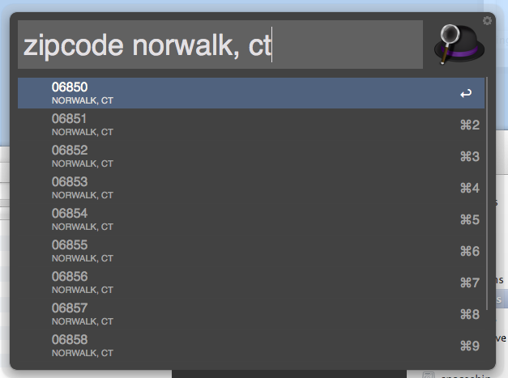

USPS Postal Code Lookup
-----------------------
Hacked together with Python, requests, lxml, and Feedback.py

Feedback.py courtesy of https://github.com/lrrfantasy/alfred-feedback-xml-generation



Before you do your first lookup, you'll need to install some Python packages:
```
sudo easy_install requests lxml
```
